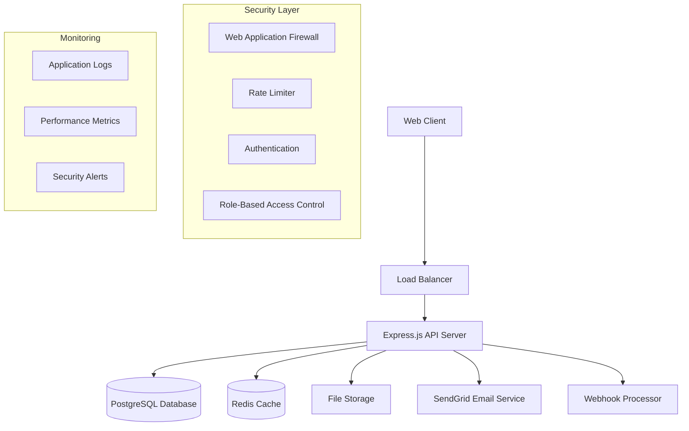

# TrustVerify System Architecture

## Overview
TrustVerify is a comprehensive fraud prevention platform built with modern web technologies, providing secure transaction processing, identity verification, and real-time fraud detection capabilities.

## High-Level Architecture



## Frontend Architecture

### Technology Stack
- **Framework**: React 18 with TypeScript
- **Build Tool**: Vite for fast development and optimized production builds
- **UI Library**: Shadcn/ui components built on Radix UI primitives
- **Styling**: Tailwind CSS with custom design system
- **Routing**: Wouter for lightweight client-side routing
- **State Management**: TanStack Query for server state synchronization
- **Form Handling**: React Hook Form with Zod validation

### Component Structure
```
client/src/
├── components/          # Reusable UI components
│   ├── ui/             # Shadcn/ui base components
│   ├── navigation.tsx  # Main navigation component
│   ├── footer.tsx      # Site footer with legal links
│   └── logo.tsx        # Brand logo component
├── pages/              # Route-based page components
│   ├── home-page.tsx   # Landing page with fraud prevention showcase
│   ├── auth-page.tsx   # Authentication (login/register)
│   ├── dashboard.tsx   # User dashboard
│   ├── transactions.tsx # Transaction management
│   ├── demo-page.tsx   # Interactive fraud prevention demo
│   └── developer-portal.tsx # API management interface
├── hooks/              # Custom React hooks
│   ├── use-auth.tsx    # Authentication state management
│   └── use-toast.tsx   # Toast notification system
├── lib/                # Utility functions and configurations
│   ├── queryClient.ts  # TanStack Query configuration
│   └── utils.ts        # Common utility functions
└── index.css           # Global styles and design tokens
```

### Key Features
- **Responsive Design**: Mobile-first approach with breakpoints at 640px, 768px, 1024px
- **Accessibility**: WCAG 2.1 AA compliant with keyboard navigation and screen reader support
- **Performance**: Code splitting, lazy loading, and optimized bundle sizes
- **SEO**: Server-side rendering support and meta tag management

## Backend Architecture

### Technology Stack
- **Runtime**: Node.js 20+ with TypeScript
- **Framework**: Express.js with async error handling
- **Database**: PostgreSQL with Drizzle ORM
- **Authentication**: Passport.js with session-based authentication
- **Session Storage**: PostgreSQL-backed sessions via connect-pg-simple
- **Email Service**: SendGrid for transactional emails
- **File Uploads**: Multer with validation and sanitization

### API Structure
```
server/
├── routes/             # API endpoint handlers
│   ├── auth.ts        # Authentication endpoints
│   ├── transactions.ts # Transaction management
│   ├── kyc.ts         # Identity verification
│   ├── fraud.ts       # Fraud detection APIs
│   └── developer.ts   # Developer portal APIs
├── middleware/         # Express middleware
│   ├── auth.ts        # Authentication middleware
│   ├── validation.ts  # Input validation
│   ├── rate-limit.ts  # Rate limiting
│   └── security.ts    # Security headers and sanitization
├── security/          # Security configurations
│   ├── config.ts      # Security policy definitions
│   ├── rbac.ts        # Role-based access control
│   └── audit.ts       # Security event logging
├── auth.ts            # Authentication system
├── storage.ts         # Database operations interface
├── db.ts              # Database connection and configuration
└── index.ts           # Application entry point
```

### Security Implementation
- **Authentication**: Secure password hashing with Argon2id
- **Session Management**: HTTP-only secure cookies with CSRF protection
- **Input Validation**: Zod schema validation for all API endpoints
- **Rate Limiting**: Progressive rate limiting based on endpoint sensitivity
- **Security Headers**: Comprehensive security headers via Helmet
- **Audit Logging**: Complete audit trail for security-relevant actions

## Database Architecture

### Schema Design
The database is designed with PostgreSQL using Drizzle ORM for type-safe operations:

#### Core Tables
- **users**: User accounts with authentication and profile data
- **sessions**: Secure session storage for authentication
- **transactions**: Escrow transactions with status tracking
- **messages**: Real-time communication between transaction parties
- **kyc_verifications**: Identity verification records and documents
- **scam_reports**: User-generated fraud reports with evidence
- **api_keys**: Developer API key management
- **audit_logs**: Security and compliance audit trail

#### Advanced Tables
- **disputes**: Transaction dispute resolution system
- **user_sanctions**: Automated sanctions tracking with escalation
- **fraud_patterns**: AI fraud detection pattern storage
- **trust_scores**: User trust score calculation and history
- **webhook_events**: Webhook delivery tracking and retry logic

### Data Relationships
```sql
-- User to Transactions (1:many)
users.id -> transactions.buyer_id
users.id -> transactions.seller_id

-- Transaction to Messages (1:many)
transactions.id -> messages.transaction_id

-- User to KYC Verification (1:1)
users.id -> kyc_verifications.user_id

-- User to Scam Reports (1:many as reporter, 1:many as reported)
users.id -> scam_reports.reporter_id
users.id -> scam_reports.reported_user_id

-- Developer to API Keys (1:many)
users.id -> api_keys.user_id
```

### Performance Optimizations
- **Indexing**: Strategic indexes on frequently queried columns
- **Connection Pooling**: Efficient database connection management
- **Query Optimization**: Prepared statements and query analysis
- **Caching**: Redis integration for frequently accessed data

## Security Architecture

### Multi-Layer Security Model

#### 1. Network Security
- **HTTPS Only**: All communications encrypted with TLS 1.3
- **HSTS**: HTTP Strict Transport Security headers
- **CSP**: Content Security Policy preventing XSS attacks
- **CSRF Protection**: Synchronizer token pattern

#### 2. Application Security
- **Input Sanitization**: All user inputs validated and sanitized
- **SQL Injection Prevention**: Parameterized queries via ORM
- **XSS Protection**: Output encoding and CSP headers
- **Authentication**: Secure session management with rotation

#### 3. Data Security
- **Encryption at Rest**: Sensitive data encrypted in database
- **Encryption in Transit**: All API communications over HTTPS
- **PII Protection**: Personal data handling per GDPR requirements
- **Backup Security**: Encrypted database backups

#### 4. Access Control
- **Role-Based Access Control**: Granular permissions system
- **API Key Authentication**: Secure developer API access
- **Session Security**: Secure session lifecycle management
- **IP Whitelisting**: Optional IP restriction for API keys

### Compliance Framework
- **GDPR**: EU data protection regulation compliance
- **CCPA**: California consumer privacy act adherence
- **KYC/AML**: Know Your Customer and Anti-Money Laundering
- **SOC 2**: Security audit framework alignment

## Fraud Detection System

### AI-Powered Analysis
```javascript
// Fraud detection pipeline
const fraudAnalysis = {
  riskFactors: [
    'transaction_amount_anomaly',
    'new_counterparty_risk',
    'suspicious_keywords',
    'velocity_check',
    'device_fingerprinting',
    'behavioral_analysis'
  ],
  
  confidenceScore: calculateConfidence(patterns),
  recommendedActions: generateRecommendations(riskLevel)
};
```

### Detection Methods
- **Pattern Recognition**: ML models trained on fraud patterns
- **Behavioral Analysis**: User behavior deviation detection
- **Network Analysis**: Connection pattern analysis
- **Real-time Scoring**: Instant risk assessment for all transactions
- **Global Intelligence**: Cross-platform fraud database integration

## Performance Considerations

### Frontend Performance
- **Bundle Optimization**: Tree shaking and code splitting
- **Asset Optimization**: Image optimization and compression
- **Caching Strategy**: Browser caching and service workers
- **CDN Integration**: Global content delivery network

### Backend Performance
- **Database Optimization**: Query optimization and indexing
- **Connection Pooling**: Efficient database connections
- **Caching Layer**: Redis for frequently accessed data
- **Load Balancing**: Horizontal scaling capabilities

### Monitoring and Observability
- **Application Performance Monitoring**: Real-time performance metrics
- **Error Tracking**: Comprehensive error logging and alerting
- **Security Monitoring**: Real-time security event detection
- **Business Metrics**: Transaction and user behavior analytics

## Scalability Architecture

### Horizontal Scaling
- **Stateless Design**: Application servers can be scaled horizontally
- **Load Balancing**: Distribute traffic across multiple instances
- **Database Scaling**: Read replicas for read-heavy operations
- **Microservices Ready**: Architecture supports service decomposition

### Vertical Scaling
- **Resource Optimization**: CPU and memory usage optimization
- **Database Tuning**: Query and index optimization
- **Caching**: Reduce database load with intelligent caching
- **Connection Optimization**: Efficient resource utilization

## Integration Architecture

### Third-Party Integrations
- **Email Service**: SendGrid for transactional emails
- **Payment Processing**: Stripe integration for payments
- **Identity Verification**: Document verification service APIs
- **Fraud Intelligence**: External fraud database integration

### Webhook System
- **Event-Driven Architecture**: Real-time event notifications
- **Retry Logic**: Robust webhook delivery with exponential backoff
- **Security**: Webhook signature verification
- **Monitoring**: Delivery tracking and failure alerting

## Development and Deployment

### Development Workflow
- **TypeScript**: Full type safety across frontend and backend
- **Hot Reloading**: Fast development iteration with Vite HMR
- **Testing**: Comprehensive test suite with 95%+ coverage
- **Code Quality**: ESLint, Prettier, and pre-commit hooks

### Deployment Pipeline
- **Build Process**: Optimized production builds
- **Environment Management**: Secure environment variable handling
- **Database Migrations**: Automated schema updates
- **Health Checks**: Application and database health monitoring

## Future Architecture Considerations

### Microservices Migration Path
1. **Authentication Service**: Extract auth logic to dedicated service
2. **Fraud Detection Service**: ML models in separate service
3. **Notification Service**: Email and webhook delivery service
4. **Document Service**: File processing and storage service

### Technology Evolution
- **GraphQL**: Consider for more flexible API queries
- **Event Sourcing**: For better audit trails and replay capabilities
- **Containerization**: Docker for consistent deployments
- **Orchestration**: Kubernetes for large-scale deployments

This architecture provides a solid foundation for a scalable, secure, and maintainable fraud prevention platform while maintaining flexibility for future enhancements and growth.